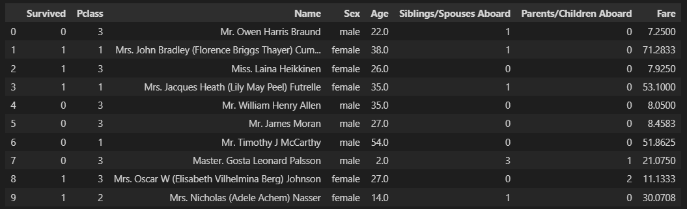

# Zadanie 1

Filip Petrán, Jakub Povinec 

[https://github.com/ns-super-team/assignment-1](https://github.com/ns-super-team/assignment-1)

---

## Cieľ

Cielom zadania bolo z dostupných dát predikovať, či na základe vstupných atribútov daný pasažier prežil.

## Dáta

Dataset je voľne dostupný na: [https://web.stanford.edu/class/archive/cs/cs109/cs109.1176/stuff/titanic.csv](https://web.stanford.edu/class/archive/cs/cs109/cs109.1176/stuff/titanic.csv).

---

Dataset, s ktorým sme pracovali obsahuje údaje o pasažieroch lode Titanic, ako napríklad vek pasažiera, trieda v ktorej cestovali (1, 2 alebo 3), pohlavie, meno, počet rodinných príslušníkov na palube alebo cena cestovného. Dataset tiež obsahuje informáciu o tom, či daný pasažier prežil (1) alebo neprežil (0) nehodu.

Vzorka dát:

Zo stĺpcov `Fare` a `Age` sme odstránili outlierov. Stĺpec `Fare` sme taktiež preškálovali pomocou Logaritmického škálovania a na obe stĺpce sme normalizovali pomocou Stadard scalera (odpočítali sme ich priemer a vydelili štandardnou odchýlkou).

Upravené dáta sme následne rozdelili na trénovací a validačný dataset v pomere 70/30 s tým, že triedy zostali zastúpené v rovnakom pomere.

## Model

**Náš najlepší model** mal 2 skryté vrstvy (32 a 16 neurónov), medzi ktorými boli ReLU aktivačné funkcie. Za druhou vrstvou bol taktiež Dropout s pravdepodobnosťou 0.3. Model sme trénovali 50 epoch. Ako optimizer sme použili Adam s 0.01 lr, ktorý sme exponenciálne zmenšovali hodnotou (gamma=0.82). 

Taktiež sme skúšali použiť iný scheduler (Step), inú aktivačnú funkciu (LeakyReLU) a väčší počet neurónov na jednotlivých vrstvách (64, 32). Pri zväcšení počtu neurónov bolo možné pozorovať väčší overfit, rovnako ako po pridaní ďalšej skrytej vrstvy. Zmena aktivačných funkcií nemala takmer žiadny dopad na výsledky trénovania, podobne ako zmena schedulera.

Vyskúšali sme meniť aj batch size (16, 32) a lr (0.1, 0.001). Zmena batch size mala už výraznejší vplyv na trénovania a modely s menším batchsize boli výrazne overfittnuté.

**Najmenší model**, ktorý sa nám podarilo urobiť mal 1 skrytú vrstvu s 8 neurónmi a bez dropout-u a LR schedulera, ktorý sme v tomto prípade nepotrebovali, keďže mal model malú kapacitu a ne-overfittoval.

## Zhodnotenie

Náš najlepší model dosiahol **validačnú accuracy 0.8528** a **validačný loss 0.4164**.